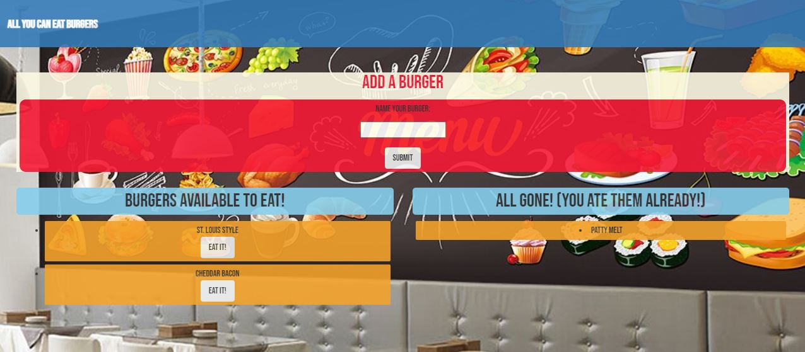

# Burger-app

A restaurant based application, to monitor inventory of burgers.

## Description
As a burger consumer
I want to be able to track the burgers left at the restaurant, and add a burger of my choice to the available burger menu. This app would also allow me to see which burgers have already been devoured.

## Table of Contents
- [Description](#description)
- [How to Use](#usage)
- [Questions](#questions)

## HOW TO USE 
NPM INIT -y
NPM I --SAVE MYSQL EXPRESS EXPRESS-HANDLEBARS

## Questions?
- contact: kmsaunders7@gmail.com
- GITHUB: kmsaunders7
- https://github.com/kmsaunders7/Burger-app